# Triage

[English](README.md) · [Русский](README.ru.md) · [Deutsch](README.de.md) · 🌐 [Landing page](https://dripips.github.io/triage/)

**Universal helpdesk for any team — from devs to vet clinics.** AI-native, self-hostable, open source.

Rails 8 · Hotwire · AI agents (OpenAI / Anthropic / YandexGPT / Ollama) · Apple-HIG · Three locales · Real-time chat.

   

---

## Why Triage

Most OSS helpdesks (Zammad, osTicket, FreeScout) were built before the LLM era and assume "customer support" context. They don't bend easily to:
- Internal IT helpdesk for a school
- Bug tracker for a 3-dev team
- Complaint system for a vet clinic
- Patient inquiries for a private practice

Triage bends — **every ticket type has its own custom fields, workflow (AASM states), and AI auto-categorization**. Configure once — the system adapts.

## Highlights

- 🤖 **AI-native** — auto-categorize, suggested replies, sentiment analysis, thread summarization. Autonomous mode: AI monitors chats and suggests corrections in real time.
- 💬 **Telegram-style chat** — real-time via Turbo Streams + Action Cable. Read receipts (✓✓), date separators, file attachments, clipboard paste, system events.
- 🧾 **Invoicing** — per-item discount + hidden surcharge, PDF print, price list integration, payment system config (Stripe / YooKassa / Tinkoff).
- 🔔 **Multi-channel notifications** — in-app bell, email (SMTP), Telegram bot, Slack webhook. All configurable per company.
- 🎨 **Custom fields per ticket type** — bend any entity to any industry (shared Dictionary pattern with HRMS).
- 🔁 **Configurable workflows** — AASM states defined per ticket type via JSON.
- 🌐 **Three locales (RU / EN / DE)** — full coverage, DB-backed per-key translation editor, language management.
- 🏗️ **Apple-HIG design** — modern UI, light + dark themes, responsive sidebar.
- 👥 **Staff / Customer separation** — customers see only their tickets, no internal messages.
- ⚙️ **11 settings sections** — General, AI, Notifications, SSO, API, KB, Price Lists, Payments, Chat, Languages, Translations.
- 🔐 **External SSO** — JWT-based login from any customer auth system.
- 📊 **AI cost dashboard** — real-time spend by task, model, usage tracking.

## Screenshots

### Sign-in
Split-screen hero with rotating slogans.
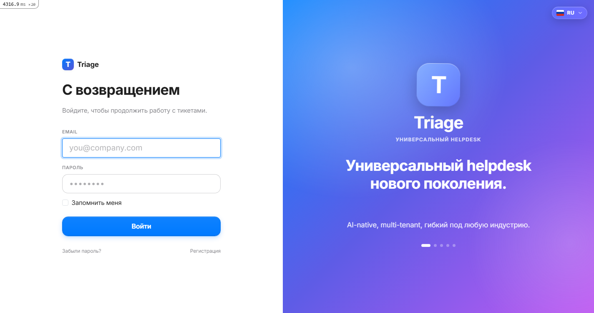

### Ticket list
Filter by type, priority, assignee. Scope chips (All / Mine / Open / Closed).
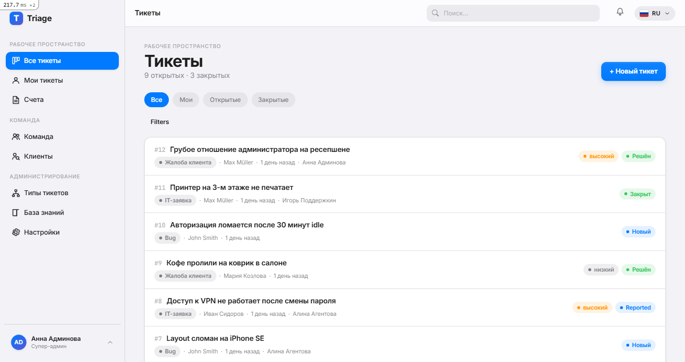

### Ticket detail
Left: TG-style chat + comments. Right: meta, actions, assign, workflow, invoice.
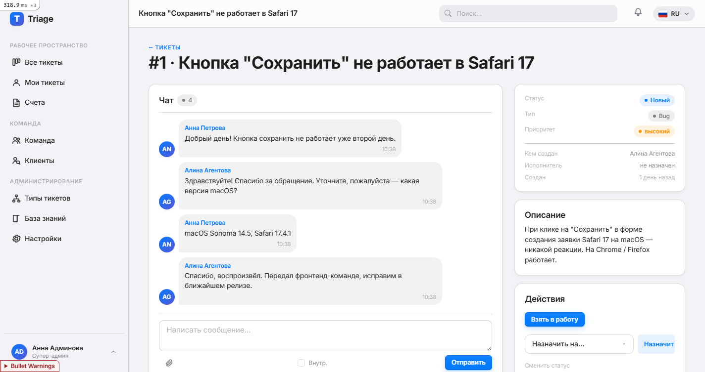

### AI Assistant settings
Standard (presets) or Advanced (full control). Cost calculator + usage dashboard.
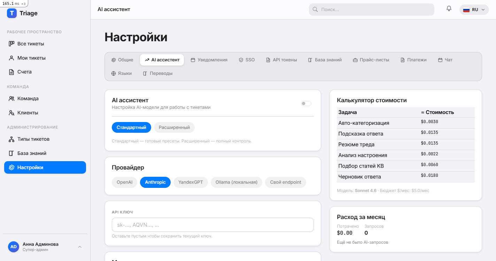

### Invoices
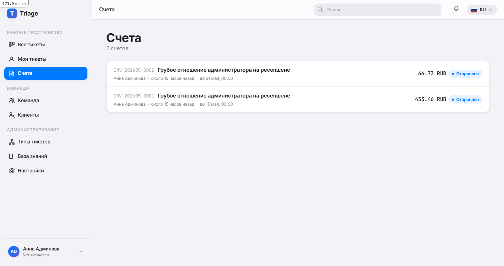

<details>
<summary><strong>More screenshots</strong></summary>

#### New ticket
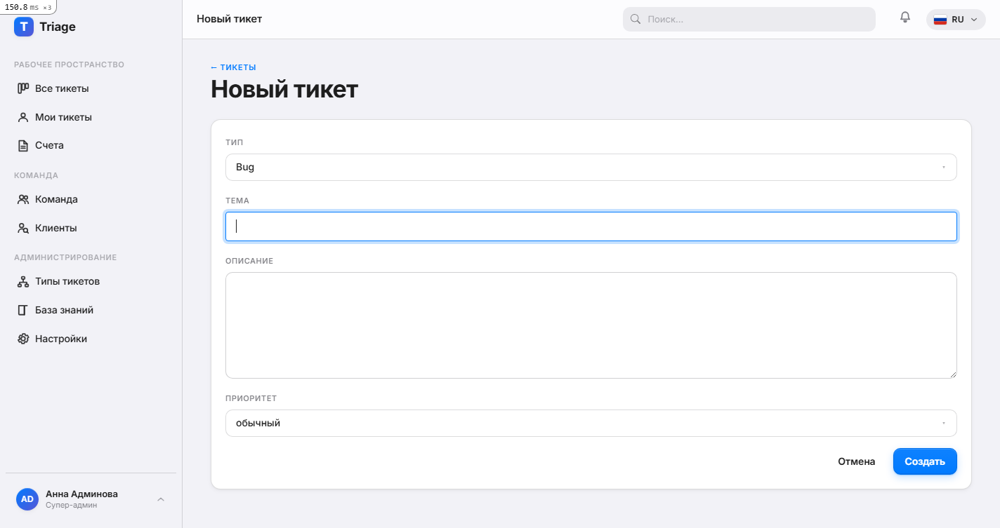

#### Team
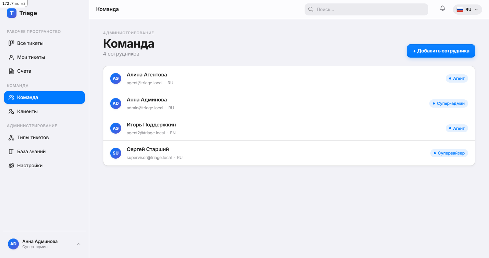

#### Customers
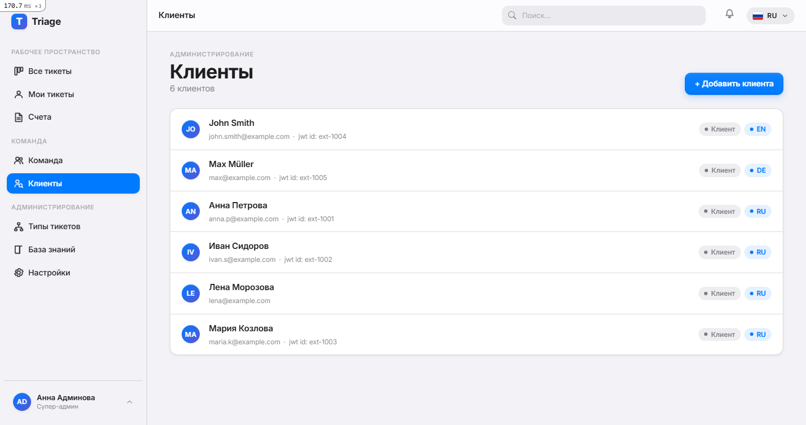

#### Ticket types
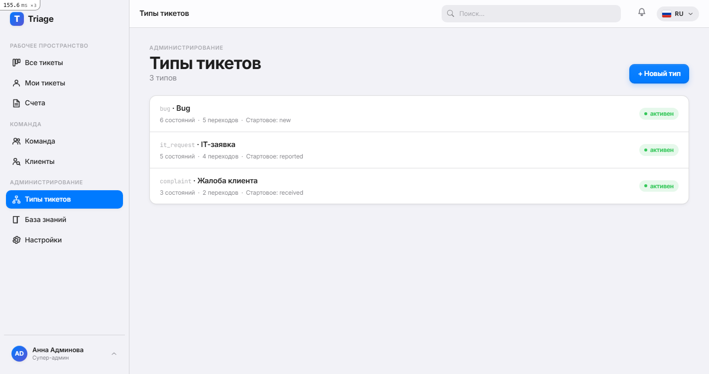

#### Settings
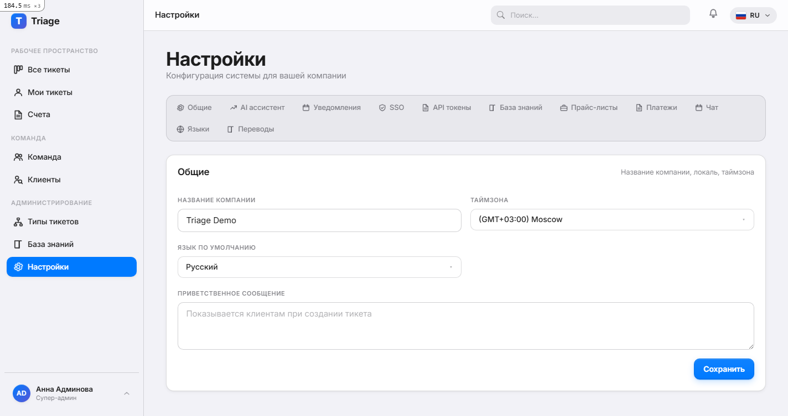

#### Knowledge base
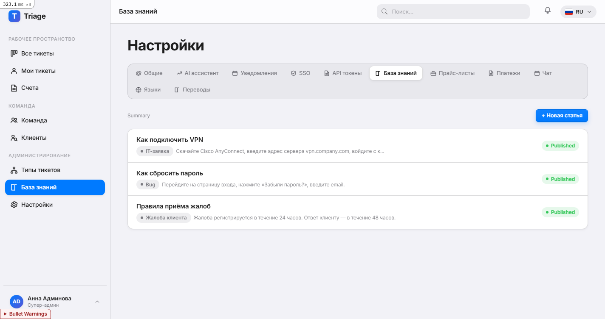

#### Price lists
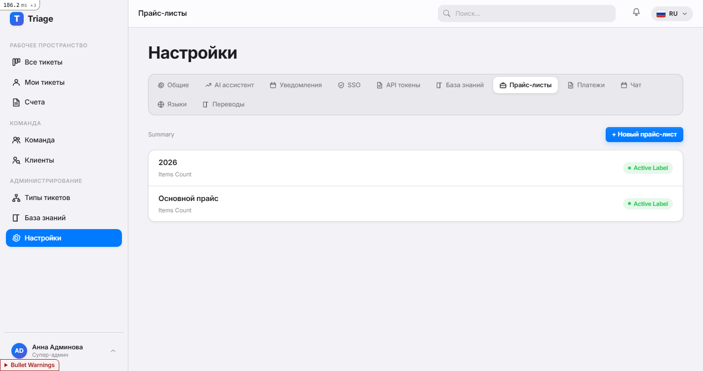

#### Notifications
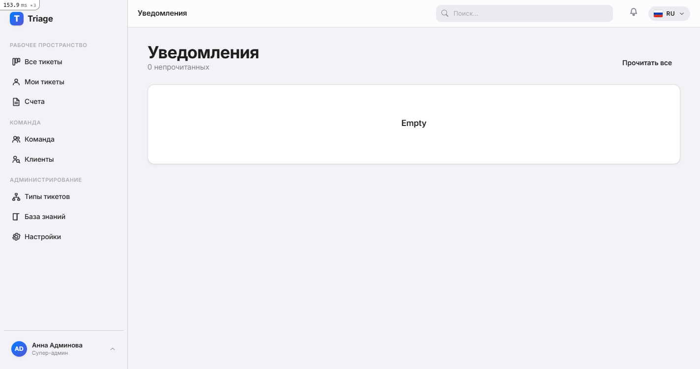

#### Languages
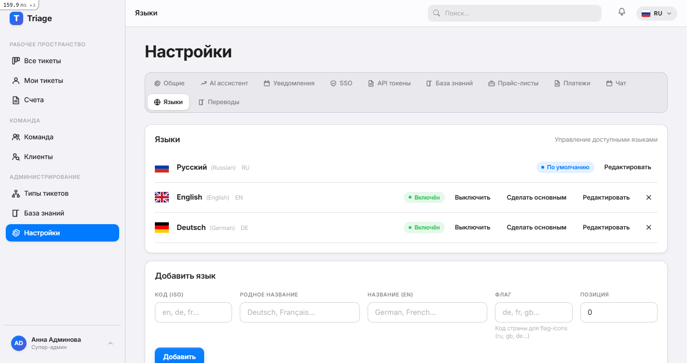

</details>

## Quick install

```bash
git clone https://github.com/dripips/triage.git
cd triage
bin/setup    # bundle + db:create + db:migrate + db:seed
bin/dev      # starts Rails + dartsass:watch
```

Open http://localhost:3000. Default accounts:

| Email | Role | Password |
|---|---|---|
| admin@triage.local | superadmin | password123 |
| supervisor@triage.local | supervisor | password123 |
| agent@triage.local | agent | password123 |
| anna.p@example.com | customer | password123 |

## Tech stack

- **Ruby 4.0.3** + **Rails 8.1.3** + **PostgreSQL 18**
- **Hotwire** (Turbo + Stimulus) — zero-reload UI
- **Solid Queue / Cache / Cable** — background jobs, caching, WebSockets
- **Bootstrap 5.3** + **Apple-HIG design system** (shared with HRMS)
- **Devise** + **Pundit** + **Discard** + **PaperTrail**
- **Active Storage** — file attachments
- **Faraday** — AI API calls (OpenAI-compatible + Anthropic)

## Built with HRMS DNA

Triage shares ~65% of its infrastructure with [HRMS](https://github.com/dripips/rubby-hrms) — sibling OSS Rails product — multi-tenant resolver, Apple design-system, AI provider abstraction, Stimulus controllers, notification delivery methods.

## License

MIT.
